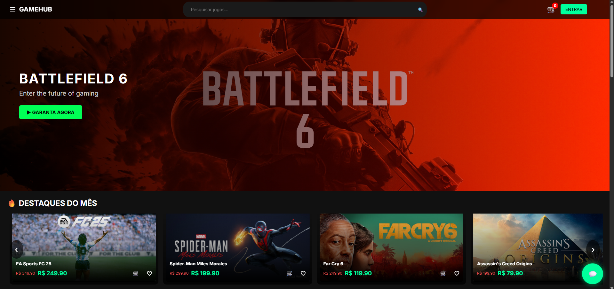
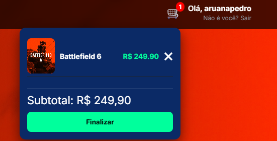
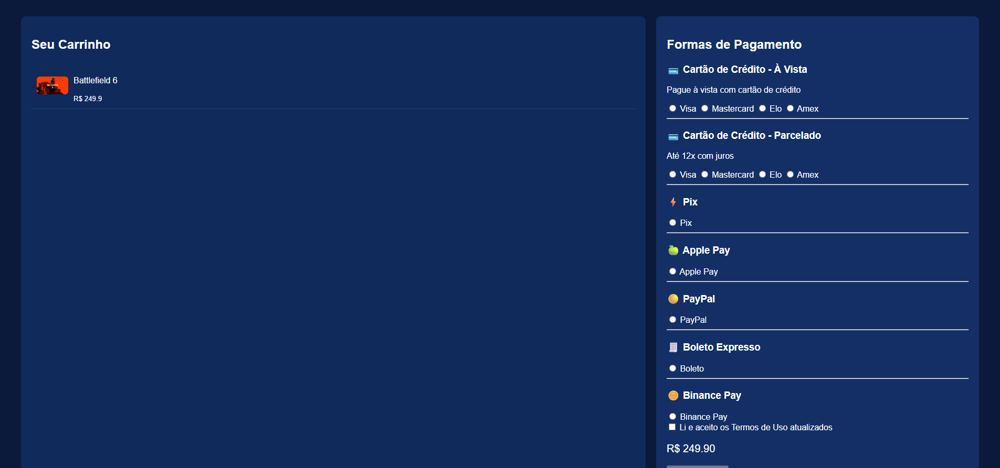
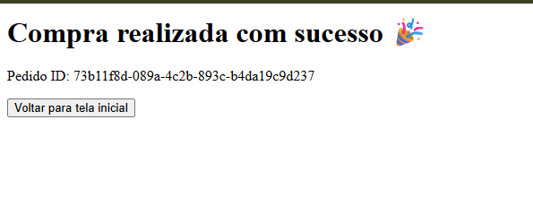

# 🎮 GameHub - Full Stack Game Store

GameHub é uma plataforma full stack de e-commerce de jogos digitais, inspirada em plataformas como Steam e Nuuvem. O sistema permite listar jogos, adicionar ao carrinho, finalizar compras e registrar pedidos em um banco de dados real.

---

## 🚀 Demo

- 🌐 Frontend (Vercel): https://gamehub-omega-blond.vercel.app/
- ⚙️ Backend (Render): https://gamehub-sl9h.onrender.com
- 🗄️ Database: Supabase

---

## 🧠 Funcionalidades

### 🛒 E-commerce
- Listagem de jogos
- Carrinho de compras
- Cálculo automático de total
- Checkout funcional

### 💳 Sistema de pedidos
- Criação de pedidos em tempo real
- Registro de itens por pedido
- Status de pedido (pendente)

### ⚙️ Backend API (FastAPI)
- API REST completa
- Integração com Supabase
- Endpoints para pedidos e checkout

---

## 🔥 Tecnologias utilizadas

### Frontend
- HTML5 / CSS3 / JavaScript
- Fetch API
- Deploy: Vercel

### Backend
- Python
- FastAPI
- Uvicorn
- python-dotenv

### Banco de dados
- Supabase (PostgreSQL)

---
📌 Status do Projeto
✔ Frontend online
✔ Backend deployado
✔ API funcionando
✔ Banco integrado
✔ Checkout operacional

## 📸 Screenshots do projeto

### 🏠 Home

### 🛒 Carrinho

### 💳 Checkout

### 🎉 Sucesso

👨‍💻 Autor

Desenvolvido por Pedro Aruanã 🚀