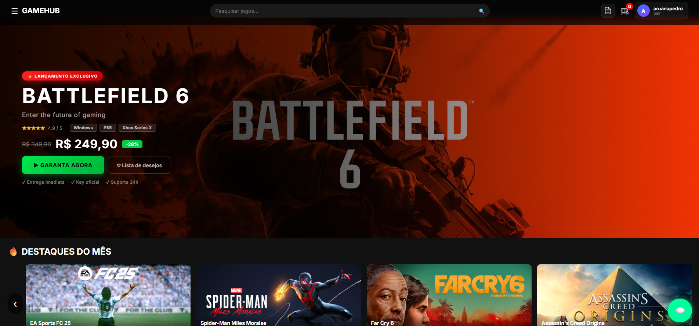
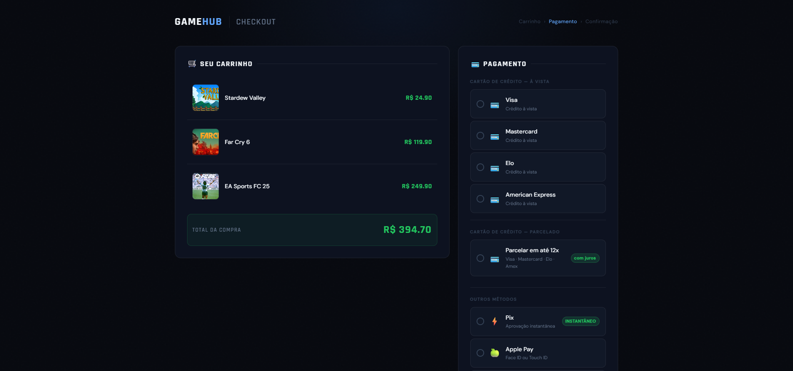

# 🎮 GameHub


Esse projeto nasceu da vontade de entender como funcionam as coisas por baixo de uma loja digital de verdade — autenticação, carrinho, checkout, banco de dados, tudo junto. Resolvi construir uma plataforma de jogos inspirada na Steam e na Nuuvem pra colocar isso em prática.

Está deployado e funcionando: frontend no Vercel, backend no Hugging Face Spaces, banco no Supabase.

---

## Acesse

- 🌐 Site: https://gamehub-omega-blond.vercel.app/
- ⚙️ API: https://pedroaruana-gamehub-api.hf.space

---

## O que dá pra fazer

- Criar conta e fazer login com e-mail e senha
- Buscar jogos em tempo real
- Favoritar jogos e ver a lista de desejos
- Adicionar ao carrinho e finalizar a compra
- Escolher forma de pagamento (Pix, cartão, PayPal, etc.)
- Acompanhar os pedidos com status colorido

---

## Tecnologias usadas

**Frontend:** HTML, CSS e JavaScript puro — sem framework, quis entender o DOM de verdade. Three.js pra cena 3D na tela de login.

**Backend:** Python com FastAPI. Aprendi bastante sobre validação de dados com Pydantic e como proteger uma API com JWT.

**Banco:** Supabase (PostgreSQL). Row Level Security ativado em todas as tabelas — cada usuário só acessa os próprios dados.

**Deploy:** Vercel (frontend) + Hugging Face Spaces (backend) — sem sleep, disponível 24h.

---

## Estrutura

```
gamehub/
├── frontend/
│   ├── index.html        → página principal
│   ├── login.html        → tela de login com animação 3D
│   ├── detalhes.html     → página do jogo
│   ├── checkout.html     → finalização de compra
│   ├── sucesso.html      → confirmação do pedido
│   ├── 404.html          → página de erro
│   ├── style.css         → estilos globais
│   ├── script.js         → lógica principal
│   ├── jogos.js          → catálogo de jogos
│   ├── toast.js          → sistema de notificações
│   └── supabaseClient.js → conexão com o banco
├── backend/
│   ├── main.py           → API FastAPI (checkout, auth)
│   ├── requirements.txt
│   └── Dockerfile        → container para deploy no Hugging Face
└── README.md
```

---

## Screenshots

### Home


### Login


### Checkout


### Sucesso


---

## Dificuldades

Algumas partes foram bem mais trabalhosas do que eu esperava.

O deploy do backend deu bastante trabalho — no Render o serviço dormia depois de inatividade e o pool de horas gratuitas era compartilhado entre projetos, o que causou instabilidade. Migrei pra o Hugging Face Spaces, que mantém o container rodando sem interrupção.

A animação 3D da tela de login foi desafiadora. Nunca tinha mexido com Three.js antes, então entender como montar a cena, a câmera e os objetos foi um processo de muito teste e erro.

Teve também um padrão chato que se repetiu algumas vezes: eu adicionava uma funcionalidade nova e quebrava algo que já tava funcionando. Aprender a testar melhor antes de subir virou um hábito a partir daí.

E as políticas de RLS do Supabase no começo eram confusas pra mim. Entender a diferença entre política de leitura e escrita, e como o `user_id` precisava bater com o usuário autenticado, levou um tempo até ficar claro.

---

## Autor

Feito por **Pedro Aruanã** — estudante de desenvolvimento web, construindo projetos reais pra aprender na prática.

- GitHub: [github.com/Pedroaruana](https://github.com/Pedroaruana)
- LinkedIn: [linkedin.com/in/pedro-aruanã](https://linkedin.com/in/pedro-aruan%C3%A3)

---

## Licença

MIT © Pedro Aruanã
